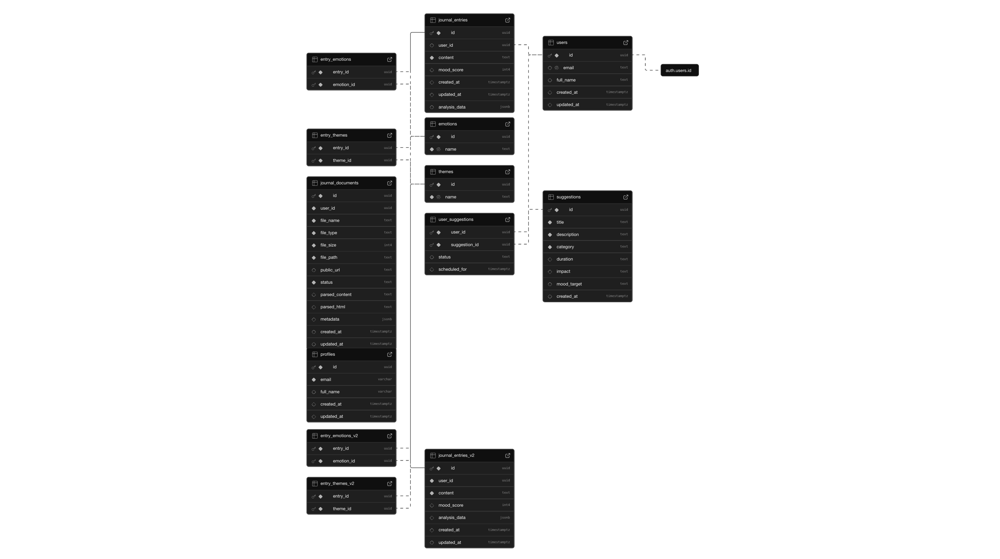

# Mood Builder - BUIDL AI 2025 Hackathon

Mood Builder - An AI-powered mood journaling platform designed to enhance your mental wellbeing by providing actionable insights, personalized feedback, and an interactive AI agent to support your emotional health journey.

###### Team Name: Indie Builder
###### Team Member: Hieu Ho (Alex)

---
# Why Mood Builder?

Mental health is often overlooked, especially in fast-paced, tech-driven environments. Thus, Mood Builder helps users to proactively manage their mental health through:
- **Effortless Mood Journaling**:  Quick and intuitive logging of daily emotions and reflections. Users can either type their entries directly or upload journal documents, including handwritten files. The system leverages Document Parsing technology from the Upstage API to extract the journal from uploaded documents.
- **Automatic Emotional Analysis**: AI-powered interpretation of journal entries using the Upstage Solar Pro model to analyze user mood score, emotions, themes based on user input journaling. 
- **Add-on Features**: Additional features include a comprehensive Mood Trends Dashboard with visual analytics and mood boosters, a convenient Recent Entries and Calendar View to review and visualize emotional patterns, and personalized Mood Boosters like guided meditations, breathing exercises, and gratitude practices. 
- **Chat with PinAI Agent**: Chat with PinAI Agent is a highly empathetic and professional psychological counselor that leverages Upstage Solar Pro for real-time mood-enhancing suggestions. It automatically fetches user persona data from PinAI and references journaling entries and today’s mood of user from Supabase. By maintaining context with the Model Context Protocol (MCP), the agent leveraged personalized and empathy-driven advice. This synergy transforms raw journaling data into actionable insights that empower each user to improve their mental wellbeing.

---
## Built With

- **Upstage AI API**: For robust document parsing and the Solar Pro model powering empathetic mood analysis and LLM inference for AI agent.

- **PinAI**: To seamlessly modify and fetch user persona data in AI agent that puts the humans at the center of conversation.

- **Next.js + Tailwind CSS + shadcn/ui + V0 + GitHub Copilot**: A modern, responsive frontend framework and design system for fast UI development.

- **Supabase**: For secure, real-time handling of journaling entries, mood data, and overall user information.

---
## Deployments

- **Platform Deployment**:  
  The Mood Builder platform is hosted on [Vercel](https://moodbuilder.vercel.app/) to ensure fast, scalable, and reliable performance.  

- **Model Context Protocol (MCP)**:  
  The MCP, which powers the PinAI Agent's context-aware interactions, is deployed as a serverless function on Vercel. It can be accessed at [https://model-context-protocol-mcp-with-vercel-functions-nine-lovat.vercel.app/sse](https://model-context-protocol-mcp-with-vercel-functions-nine-lovat.vercel.app/sse) with source code at [https://github.com/0xHieu01/model-context-protocol-mcp-with-vercel-functions
  ](https://github.com/0xHieu01/model-context-protocol-mcp-with-vercel-functions).  

- **PinAI Agent**:  
  The MoodBuilder Agent, one of core feature of Mood Builder, is created and managed on the PinAI platform. You can view the agent at [https://agent.pinai.tech/agent/338](https://agent.pinai.tech/agent/338).  
  In addition, Personal Profile is also modified to highlight the use case of this application. Assume users have some mental health problems.

---
## Project Structure
```
MoodBuilder/
├── app/                        # Next.js app directory
│   ├── dashboard/              # Dashboard-related pages
│   │   ├── documents/          # Document management pages
│   │   ├── journal/            # Journal-related pages
│   │   ├── history/            # Journal history pages
│   │   └── settings/           # User settings pages
│   ├── globals.css             # Global CSS styles
│   ├── layout.tsx              # Root layout for the app
│   └── page.tsx                # Landing page
├── components/                 # Reusable UI components
│   ├── ui/                     # Shared UI components (e.g., buttons, cards, sliders)
│   ├── dashboard-sidebar.tsx   # Sidebar component for the dashboard
│   ├── mood-chart.tsx          # Mood chart visualization component
│   └── theme-provider.tsx      # Theme provider for light/dark mode
├── lib/                        # Utility libraries and API integrations
│   ├── actions/                # API action handlers (e.g., mood analysis, uploads)
│   ├── supabase.ts             # Supabase client configuration
│   └── utils.ts                # General utility functions
├── public/                     # Static assets (images, icons, etc.)
├── styles/                     # Additional styles
│   └── globals.css             # Global CSS styles
├── types/                      # TypeScript type definitions
│   └── database.ts             # Database schema types
├── components.json             # ShadCN UI configuration
├── tailwind.config.ts          # Tailwind CSS configuration
├── tsconfig.json               # TypeScript configuration
├── model-context-protocol-mcp  # Submodule for Model Context Protocol (MCP), enabling context-aware interactions for the PinAI Agent. 
│                               # Hosted as a serverless function on Vercel. Repository: https://github.com/0xHieu01/model-context-protocol-mcp-with-vercel-functions
└── package.json                # Project dependencies and scripts

```

---
## Supabase Schema



---
## Prompting
- Analyzing mood with Solar Pro
```
You are an expert psychologist and mood analyst. Your task is to analyze the following journal entry and determine:

1. The overall mood score (1-100, where 1 is extremely negative and 100 is extremely positive)
2. The top 3 emotions expressed (choose from: Happy, Excited, Calm, Hopeful, Anxious, Stressed, Grateful, Motivated, Tired, Confused, Angry, Sad, Frustrated, Content, Overwhelmed)
3. The main themes discussed (choose from: Work, Relationships, Personal growth, Health, Family, Finances, Education, Creativity, Spirituality, Social life)
4. A brief summary of the mood and themes (2-3 sentences)

Respond in the following JSON format only:
{
  "mood_score": [number between 1-100],
  "emotions": ["emotion1", "emotion2", "emotion3"],
  "themes": ["theme1", "theme2"],
  "summary": "Brief summary of the mood and themes"
}

Journal entry:
${content}
```

- Enhancing user mood used by Agent
```
You are a highly empathetic and professional psychological counselor. Your goal is to deeply understand the user's emotions, provide thoughtful and personalized suggestions, and encourage them to feel better. Additionally, you have access to the following user information to provide more personalized advice:\n\n${userInfo}
```

---
## Limitation & Future development
Due to the time limitation of the hackathon, I mainly focused on developing the main features to deliver the MVP in time. Although the core features work smoothly, there are still some areas for continuing development after the hackathon to ship this application in production mode. For example, enhancing the UI features, fixing minor issues, fully enhancing the authentication process for production mode and handling a large number of users.

Thank you for exploring Mood Builder! I hope you find it helpful and enjoyable. 
